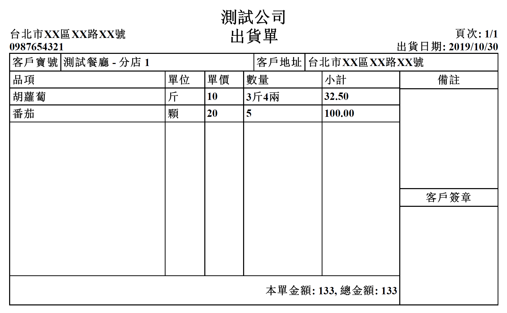
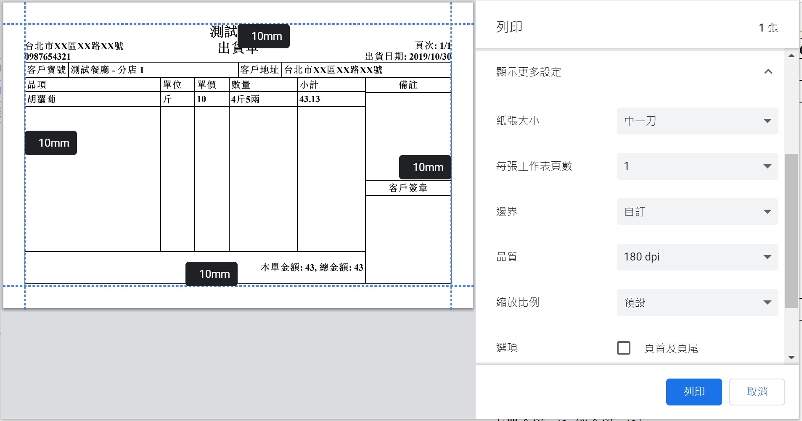

# Shipment Creator

讓小型企業在沒有 ERP 系統的環境下，利用網頁直接產生出貨單。

https://oscar60310.github.io/shipment-creator

## 列印設定

### 中一刀 (9.5 x 11)

- 選擇正確的紙張大小。
- 邊界選擇「自訂」，設定四邊皆為 10mm。
- 取消「頁首及頁尾」方塊。

### 

## 單位轉換

### 斤/兩

當品項的單位為「斤」時，數量輸入會自動變為斤/兩輸入。

## 離線支援

使用 Chrome 開啟網頁後，未來即可使用網址直接進入，不需要網路連線。也可以按下網址列後方的 + 號，安裝到桌面上直接開啟。

## 開發

使用 React + Typescript 開發，資料儲存在 Localstorage 以及 Index DB 中。

### 修改專案

1. Clone repository `git clone git@github.com:oscar60310/shipment-creator.git`
2. Install package `npm install`
3. Run test server `npm start`
4. Open http://localhost:8080

### 編譯 (Webpack)

`npm run build`

檔案會生成在 build 資料夾

### 部屬到 Github Page

`npm run deploy`

### 功能

- [x] 設定公司名稱/住址/電話
- [x] 產品列表維護
- [x] 客戶列表維護
- [x] 中一刀報表
- [x] 報表自動分頁
- [x] 斤/兩 輸入
- [x] PWA 支援
- [ ] 備份/復原設定
- [ ] 報表儲存